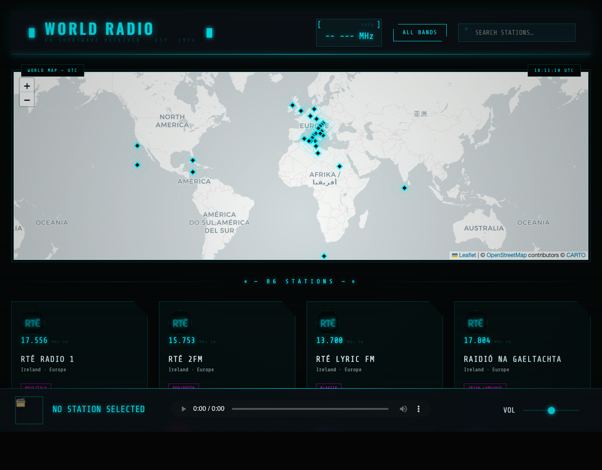

# WebRadio - 1970s Shortwave Aesthetic

A vintage-inspired web radio receiver with a high-fidelity 1970s aesthetic. This project features a brushed steel interface, analog-style displays, and a collection of international radio stations including the Bavarian BR suite.

*(Note: Replace 'screenshot.png' with an actual screenshot of your application)*

## Features

- **Retro Aesthetic:** Brushed steel finish with chrome accents and darkened amber/phosphor displays.
- **Global Coverage:** Integrated interactive map using Leaflet.js, displaying custom diamond-shaped pins for radio stations. Pin placement accuracy has been improved.
- **High-Quality Streams:** Support for MP3 and HLS (m3u8) streams.
- **BR Suite:** Includes Bayern 1, Bayern 2, BR3, and BR24 with official logos and direct stream URLs.
- **Responsive Design:** Optimized for both desktop hi-fi fans and mobile listeners.

## Technologies Used

- **HTML5/CSS3:** Custom brushed metal textures and layout.
- **JavaScript (Vanilla):** Station management, audio playback logic, and metadata polling.
- **Leaflet.js:** Interactive geographical mapping.
- **Hls.js:** Support for high-quality adaptive bitrate streams.

## Getting Started

Simply open `index.html` in any modern web browser to start your shortwave journey.

## Contributing

1. Fork the repository
2. Create your feature branch (`git checkout -b feature/AmazingFeature`)
3. Commit your changes (`git commit -m 'Add some AmazingFeature'`)
4. Push to the branch (`git push origin feature/AmazingFeature`)
5. Open a Pull Request

## License

This project is open source.
